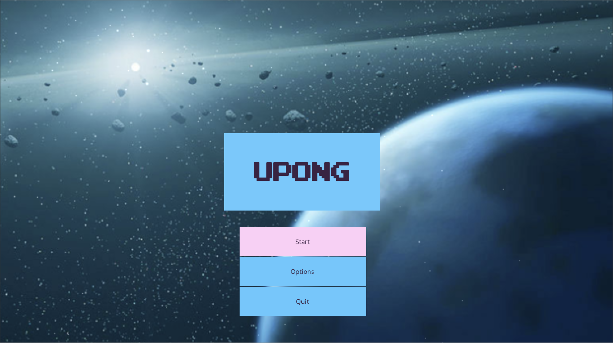
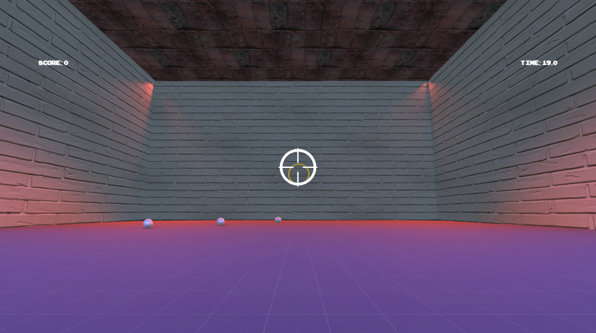

# UPong

## About

UPong is a first-person shooter game where we as a player shoots balls to a randomly placed rings. 
The goal of the game is to get as much score as possible by shooting accurately to the ring in a given time (default: 60s) 

Built for ITB-IF3111 class assignment.  

## Display

   

 

## How to Install
1. Open project through unity
2. Build all the scenes with the platform of your choosing (tested on Desktop platform)
3. Run the built app
4. Play the game!

## Technology
- Unity Engine, coded using Unity IDE
- C# as Unity's main programming language.

## Authors
Yusuf Rahmat Pratama - *Developer* 
Priagung Satyagama - *Developer* 
Ilham Firdausi Putra - *Developer*

